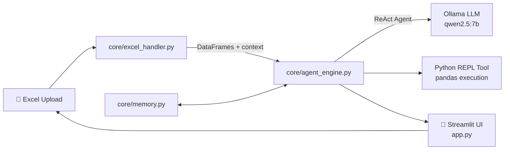

<div align="center">

# 📊 Sales AI Agent

### Chat with your Excel files in plain Azerbaijani - no formulas, no pivot tables, just questions.

[](https://www.python.org/)
[](https://streamlit.io/)
[](https://www.langchain.com/)
[-000000?logo=ollama&logoColor=white)](https://ollama.com/)
[](LICENSE)

[Features](#-features) • [Installation](#-installation) • [Usage](#-usage) • [Architecture](#-architecture)

</div>

---

## 💡 About

**Sales AI Agent** is a local, privacy-first AI assistant that lets business users upload any Excel file and ask questions about it in **natural Azerbaijani language** - instead of writing formulas or digging through pivot tables.

Under the hood, it turns each question into real pandas code, executes it, and explains the result back in plain language. Because it runs on a **local LLM via Ollama**, your data never leaves your machine - no API keys, no cloud upload, no vendor lock-in.

> Built for teams who work with sales/credit spreadsheets daily and want answers in seconds, not spreadsheet gymnastics.

## Features

- **Multi-sheet Excel support** - upload files with any number of sheets, the agent maps each one automatically
- **Natural language Q&A** - ask in Azerbaijani, get Azerbaijani answers, grounded in real computed results
- **Real pandas execution** - the agent writes and runs actual code (no hallucinated numbers)
- **Conversation memory** - follow-up questions understand prior context (sliding window)
- **100% local & private** - powered by Ollama, no data ever leaves your machine
- **Instant context building** - automatic column/type/summary statistics fed to the model on upload

## 🎯 Target Audience

Who this project is built for:

- **SME owners & managers** - people who keep sales, credit, or inventory data in Excel but don't know formulas or pivot tables
- **Sales & finance teams** - get quick answers from reports without manually building queries each time
- **Credit/banking professionals** - ask questions directly about credit portfolios (e.g. overdue payments, risk segments)
- **Privacy-conscious organizations** - banking, legal, healthcare, or any team that can't send sensitive data to a cloud LLM API
- **Azerbaijani-speaking teams** - no need to work around English-only AI tools
- **Non-technical staff** - no SQL, Python, or Excel formula knowledge required, just natural language questions

## 🏗️ Architecture



The agent follows a **ReAct** (Reason + Act) loop: it reasons about the question, writes pandas code, executes it in a sandboxed REPL tool, observes the result, and repeats until it can give a final grounded answer - all explained in Azerbaijani.

## Tech Stack

| Layer | Technology |
|---|---|
| UI | [Streamlit](https://streamlit.io/) |
| Agent framework | [LangChain](https://www.langchain.com/) (ReAct agent) |
| LLM runtime | [Ollama](https://ollama.com/) - `qwen2.5:7b` (local, no API key) |
| Data processing | pandas, openpyxl |
| Memory | LangChain `ConversationBufferWindowMemory` |

## 📂 Project Structure

```
sales-ai-agent/
├── app.py                    # Streamlit UI & session state
├── core/
│   ├── __init__.py
│   ├── agent_engine.py       # ReAct agent, prompt template, REPL tool
│   ├── excel_handler.py      # File loading, context building
│   └── memory.py             # Conversation memory config
├── screenshots/               # Images used in this README
├── requirements.txt
├── .gitignore
├── LICENSE
└── README.md
```

## ⚙️ Prerequisites

- **Python 3.10+**
- **[Ollama](https://ollama.com/download)** installed and running locally
- The `qwen2.5:7b` model pulled:
  ```bash
  ollama pull qwen2.5:7b
  ```

## 🚀 Installation

```bash
# 1. Clone the repository
git clone https://github.com/1Sultanz/sales-ai-agent.git
cd sales-ai-agent

# 2. Create and activate a virtual environment
python -m venv venv
source venv/bin/activate      # Windows: venv\Scripts\activate

# 3. Install dependencies
pip install -r requirements.txt

# 4. Make sure Ollama is running with the model available
ollama pull qwen2.5:7b
ollama serve                  # if not already running
```

## Usage

```bash
streamlit run app.py
```

1. Open the app in your browser (Streamlit will show the local URL)
2. Upload an `.xlsx` / `.xls` file from the sidebar
3. Ask a question in the chat box - e.g. *"Ən çox satış edən region hansıdır?"*
4. The agent computes the real answer from your data and explains it in Azerbaijani

## 🔧 Configuration

Model and connection settings live in `core/agent_engine.py`:

```python
OLLAMA_BASE_URL      = "http://localhost:11434"
OLLAMA_MODEL         = "qwen2.5:7b"
AGENT_MAX_ITERATIONS = 15
```

Swap `OLLAMA_MODEL` for any Ollama-compatible model you have pulled locally.

## Notes & Limitations

- The agent executes Python code to answer questions - intended for **trusted, local use** with your own data, not as a public-facing multi-tenant service.
- Answer quality depends on the local LLM's capability; larger models (e.g. `qwen2.5:14b`) may give more accurate results at the cost of speed.
- Currently answers are generated in Azerbaijani only.

## Contributing

Contributions, issues, and feature requests are welcome - feel free to check the [issues page](../../issues).

## License

Distributed under the MIT License. See [`LICENSE`](LICENSE) for details.

## Author

**Sultanli Zamin**
[LinkedIn](https://www.linkedin.com/in/zamin-sultanl%C4%B1-604071265/) • [GitHub](https://github.com/1Sultanz)
